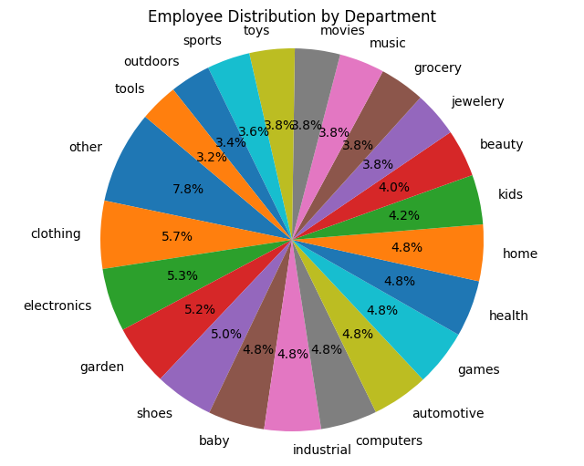

# salary_analysis_sql
## Workforce Financial Analysis Across Departments and Regions


##### This project performs a workforce financial analysis using a mock SQL database that simulates employee salary and departmental data. The goal is to derive actionable insights from a financial analyst's perspective, identifying salary trends, cost optimizations, and organizational imbalances.

### Project Objective
Perform an in-depth financial analysis of employee salary distributions across departments and regions to uncover:
*   Salary optimization opportunities
*   Underperforming or overstaffed departments
*   Regional salary disparities
*   Executive and operational cost patterns

### Tables Overview:
- `employees`: Employee records including salary, department, job title, region, and start date.
- `company_departments`: Department metadata and divisions.
- `company_regions`: Region and country data.

### Methodology & Queries Used
All analysis was done using SQL (PostgreSQL syntax). Example queries include:
```
```sql
-- Total salary by department
SELECT d.department_name, SUM(e.salary) AS total_salary
FROM employees e
JOIN company_departments d ON e.department_id = d.id
GROUP BY d.department_name
ORDER BY total_salary DESC;
```

### Employee Salary Insights
#### Key insight 1


- **The "Other" department** has the highest total salary expenditure, indicating a large workforce or high-paying roles. Further breakdown may be needed to understand its composition.
- **Clothing, Shoes, Electronics, and Garden departments** follow closely, suggesting they may include key operational roles or sales functions driving higher compensation.

- **The Shoes department** ranks highest in terms of average salary (~$112K), which may indicate specialized or senior-level roles.

- The **Southwest region** of the U.S. has the highest average salary, exceeding $100,000, suggesting the presence of high-paying roles or industries in that region.
- **Canadian regions** (Nova Scotia, Quebec, British Columbia) all appear in the top 5, indicating competitive compensation across Canada's provinces.
-The salary gap between regions is relatively small, with the top and fifth regions differing by only about $3,600.

- **The "other" department** has the highest number of employees (88), which may indicate that it contains miscellaneous or uncategorized roles. This could be a sign that further classification is needed for better organizational insight.
- **The "computers", "clothing", "electronics", and "industrial" departments** all have similarly large employee counts, ranging between 52-53 employees.
-These departments likely represent core business areas that require larger teams, whether in production, sales, support, or engineering.

- **The Southwest region (USA)** leads with the highest total salary expenditure, suggesting a concentration of employees or high-paying positions in that area.

- The highest average salaries are held by senior-level roles in **accounting, engineering, and media management**. 
- **The "budget/accounting analyst iii"** is notable for appearing multiple times (4 employees) while still maintaining a very high average.


#### Key insight 2


- Nearly half (48%) of employees earn over $100K annually, indicating a high-income workforce.
- The Medium and High salary brackets collectively cover ~43%, showing a healthy middle tier.
- Only 8.4% of employees fall below $50K, suggesting relatively few low-income roles exist.


#### Key insight 3


- Salaries increase from New Hire to Mid-level, peaking around $98K at 5–8 years of service.
- Surprisingly, the Senior bracket (8–11 years) has a slightly lower average salary than the Mid-level group, suggesting:
  - Potential salary stagnation beyond year 8
  - Influence of lower-paid long-tenured roles

- The largest group is Mid-level, followed by Senior and Junior levels.

#### Key insight 4


- Departments like **Outdoors, Games, and Movies** show the highest salary variability, with CVs over 35%, indicating possible pay inconsistencies or wide salary bands across roles.
- Even within small teams (e.g. 37–52 employees), salary range is huge, with maximums exceeding $145K and minimums dipping below $45K.
- This information is crucial for HR audits, pay equity evaluations, and compensation strategy improvements.

#### Key insight 5


- Top 10% earners in **the Automotive department** make well above $135K.
These employees are distributed across multiple regions, indicating that location may not be the main driver of top compensation role type likely plays a bigger part.
- Titles like **Professor** and **Media Manager** suggest some specialized, high-value roles are embedded even in a department like Automotive.

#### Key insight 6


- **‘Other’ department** has the highest number of employees earning above the department average (41 employees).
- **Top 5 departments** with the most above-average earners are:
  - Other, Clothing, Electronics, Garden, Shoes.
- Most departments (~20) have around **25 employees** earning above average, suggesting a balanced pay structure.
- Some departments (e.g., Tools, Outdoors, Sports) have relatively fewer high earners.
- The pie chart reflects this distribution, with bigger slices for departments with more high earners.