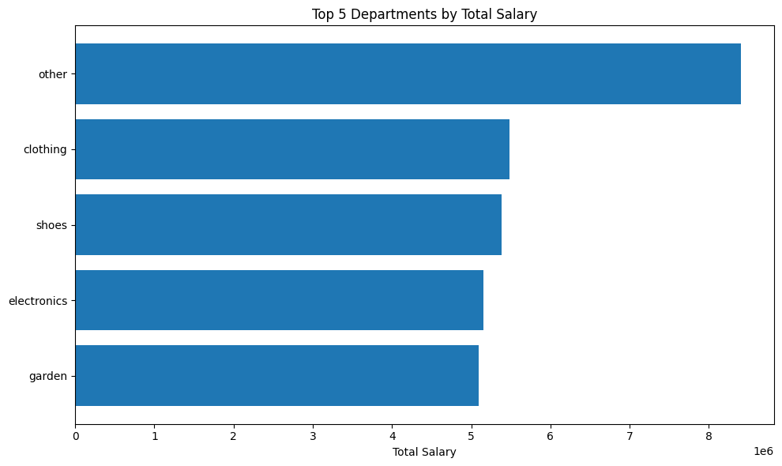
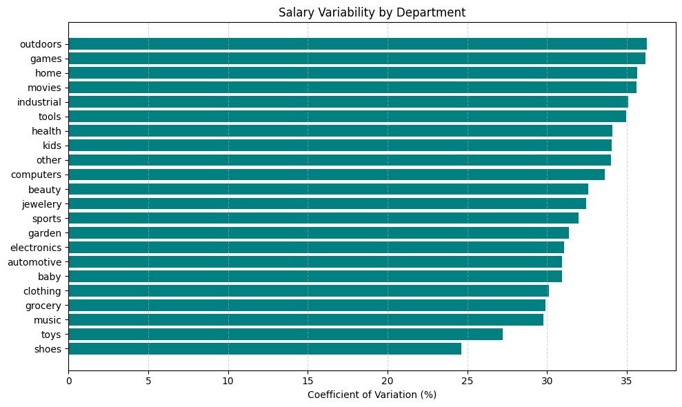

# salary_analysis_sql
## Financial Analysis of Workforce by Department and Region


#### The purpose of this project is to evaluate the financial analysis of the workforce with fake data in an SQL database which includes mocked employee salary and department records. ,The overall goal of the project was to uncover salary trends, cost optimization strategies, and workforce imbalances from a financial analyst perspective. 


### Project Objective
We will develop a financial analysis of employee salary distributions with department and region data to evaluate:
* Salary optimization strategies
* Underperforming / or overstaffed departments
* Salary dispersion by region
* Executive versus Operational costs 

### Tables Overview:
- `employees`: Employee's information with salary, department, job title, region, and start date.
- `company_departments`: Department metadata and divisions.
- `company_regions`: Region and country data.


### Methodology & Queries Used
In this project, I utilized PostgreSQL to develop 15 key queries aimed at analyzing workforce salary data.
Key analyses include:
- Calculating total and average salaries by department and region.
- Categorizing employees into salary brackets.
- Applying window functions such as RANK() and PERCENT_RANK() to determine salary rankings within each department.
- Using statistical measures like standard deviation and percentiles to identify departments with the largest salary disparities.
```
```sql
-- Total salary by department
SELECT d.department_name, SUM(e.salary) AS total_salary
FROM employees e
JOIN company_departments d ON e.department_id = d.id
GROUP BY d.department_name
ORDER BY total_salary DESC;
```

### Employee Salary Insights
#### Key insight 1


- **The "Other" department** has the highest total salary budget, implying that it either has a big volume of staff or large salary positions. It would make sense to categorize this department further to see its make-up.
- **Clothing, Shoes, Electronics, and Garden departments** follow closely, suggesting they may include key operational roles or sales functions that are resulting in the higher average salaries.

- **The Shoes department** ranks the highest average salary (~$112K), which may indicate specialized or possibly senior-level roles.

- The **Southwest region** of the U.S. has the highest average salary, exceeding $100,000, suggesting the presence of high-paying roles or industries in that region.
- **Canadian regions** (Nova Scotia, Quebec, British Columbia) all appear in the top 5, indicating competitive compensation across Canada's provinces.
-The salary gap between regions is relatively small, with the top and fifth regions differing by only about $3,600.

- **The "other" department** has the highest number of employees (88), which may indicate that it contains uncategorized roles. This could be a sign that further classification is needed for better organizational insight.
- **The "computers", "clothing", "electronics", and "industrial" departments** all have similarly large employee counts, ranging between 52-53 employees.
-These departments likely represent core business areas that require larger teams, whether in production, sales, support, or engineering.

- **The Southwest region (USA)** leads with the highest total salary budget, suggesting a concentration of employees or high-paying positions in that area.

- The highest average salaries are held by senior-level roles in **accounting, engineering, and media management**. 
- **The "budget/accounting analyst iii"** is notable for appearing multiple times (4 employees) while still maintaining a very high average.


#### Key insight 2


- Nearly half (48%) of employees earn over $100K annually, indicating a high-income workforce.
- The Medium and High salary brackets collectively cover ~43%, showing a healthy middle tier.
- Only 8.4% of employees fall below $50K, suggesting relatively few low-income roles exist.

#### Key insight 3


- Departments like **Outdoors, Games, and Movies** show the largest variation in salary, with CVs over 35%, indicating possible salary inequities or large and wide ranges of compensation for roles. 
- Even within small teams (e.g. 37–52 employees), salary range is huge, with maximum salaries greater than $145K and minimum salaries less than $45K.
- This data is useful for HR audits, pay equity assessments, and improvement plans for compensation strategy.

#### Key insight 4


- Top 10% earners in **the Automotive department** make well above $135K.
These employees are distributed across multiple regions, indicating that location may not be the main driver of top compensation role type likely plays a bigger part.
- Titles like **Professor** and **Media Manager** suggest some specialized, high-value roles are embedded even in a department like Automotive.

#### Key insight 5


- **‘Other’ department** has the highest number of employees earning above the department average (41 employees).
- **Top 5 departments** with the most above-average earners are:
  - Other, Clothing, Electronics, Garden, Shoes.
- Most departments (~20) have around **25 employees** earning above average, suggesting a balanced pay structure.
- Some departments (e.g., Tools, Outdoors, Sports) have relatively fewer high earners.
- The pie chart reflects this distribution, with bigger slices for departments with more high earners.

#### Learning
Writing SQL queries is only the first step.
The real value comes from interpreting data in a business context and turning it into actionable recommendations, for example:

- Reclassifying departments
- Reviewing pay equity
- Adjusting budgets

These analytical skills are directly applicable to budgeting, workforce planning, and compensation strategy.
